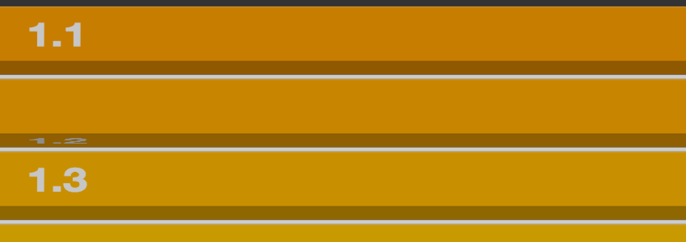

# Venetian.js
**Venetian blind-like banner made of rolling stripes animated with CSS3 3D transforms**
*The development of this plugin was made at [Uplight](http://uplig.ht)*



## Demo

[**Try the demo project**](http://dulaccc.github.com/Venetian.js)

## Usage

### Dependencies

* [Photon](https://github.com/thomasxiii/photon) is *optional* but it makes the animation more realistic by adding some shadows during the rolling animation.

### Installation

1. Clone the repository 

    ```sh
    $ git clone git://github.com/dulaccc/Venetian.js.git
    ```

2. Then you need to configure the size of your stripes, because it changes all the css values needed for the CSS 3D transforms.

    Just open the `stripes.scss` file and modify the variables in the head of the file. And when you're done, run the following command to override the default css styles that I was using.

    ```sh
    $ sass stripes.scss:stripes.css
    ```

3. Copy of the following files to your project :
    * [`jquery.venetian.min.js`](http://raw.github.com/dulaccc/Venetian.js/master/venetian.js.min.js) 
    * `stripes.css` the one you've just generated or the one by default
    * [`photon.min.js`](https://raw.github.com/thomasxiii/photon/master/js/photon.min.js) *optional* but recommanded

4. Check out the [example/index.html](http://github.com/dulaccc/Venetian.js/master/example/index.html) file to see how to initialize the module in your project and load some data in the stripes.

## Minified version

The minified version was generated using the `uglifyjs` command line tool.

```sh
$ uglifyjs venetian.js -cm --lint -o venetian.min.js
```

> the picture of kittens comes from [placekitten](http://placekitten.com)

## Roadmap

* Improve the way we set a stripe background image, the plugin should take care of the `background-position` not the user.
* Reverse the animation with a `previous` method

## Contact

[Pierre Dulac](http://github.com/dulaccc)  
[@dulaccc](https://twitter.com/dulaccc)

## License

Venetian.js is available under the MIT license. See the LICENSE file for more info.